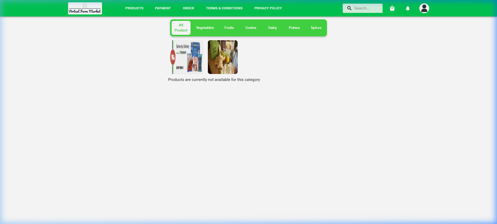
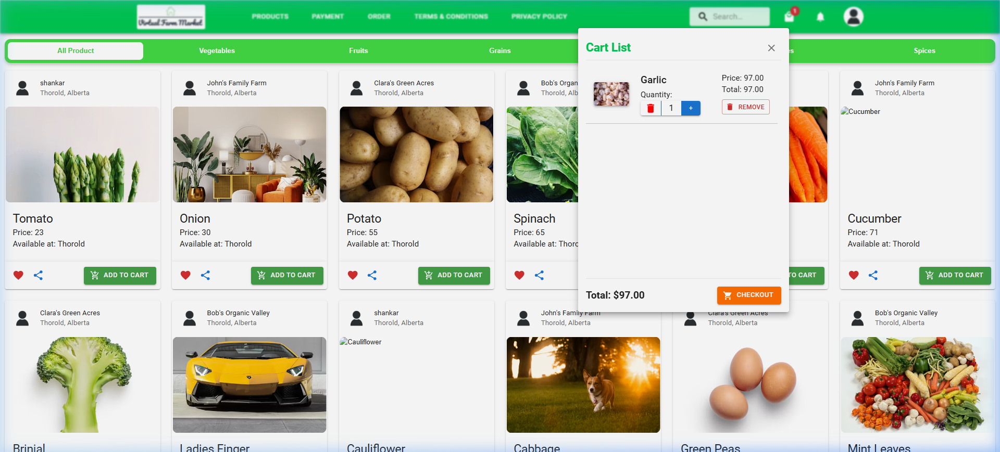
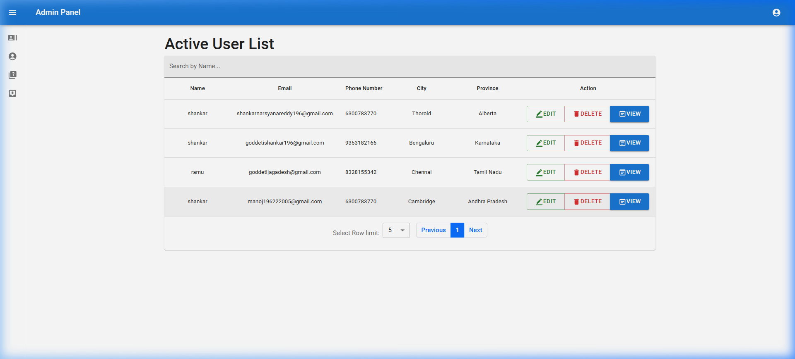

# Virtual Farm Market (VFM) 🌾🛒

**Virtual Farm Market (VFM)** is a fully localized e-commerce web application designed to connect local farmers directly with consumers, removing middleman markups and promoting fresh, local produce. 

The application is localized for the Indian market, featuring regional location dropdowns, seeders for major Indian cities/states, and prices displayed in Indian Rupees (₹). It is fully containerized using **Docker** and automated to deploy to **AWS** via **GitHub Actions** CI/CD pipelines.

---

## 🌐 Live Project Links

Access the production deployment of the project using the links below:

*   **Production CDN Portal (CloudFront)**: [http://d10nxcxgwlmtbw.cloudfront.net](http://d10nxcxgwlmtbw.cloudfront.net) *(HTTP compatible)*
*   **Static Assets Gateway (S3 Website)**: [http://vfm-frontend-shankar.s3-website.ap-south-1.amazonaws.com](http://vfm-frontend-shankar.s3-website.ap-south-1.amazonaws.com)
*   **Backend REST API Server (Elastic Beanstalk)**: [http://vfm-backend-app-env.eba-xemkvnmp.ap-south-1.elasticbeanstalk.com](http://vfm-backend-app-env.eba-xemkvnmp.ap-south-1.elasticbeanstalk.com)

---

## 📸 Application Screenshots

### 1. Interactive Landing Page
The entry portal welcoming consumers, farmers, and administrators.


### 2. Customer Dashboard & Products
Allows buyers to explore local organic produce grouped by categories (Vegetables, Fruits, Grains, Dairy, Pulses, Spices).


### 3. Shopping Cart Drawer
Fluid slide-out cart drawer calculating pricing, localized taxes, and shipping rates.


### 4. Admin Administration Panel
A comprehensive analytics dashboard for managing users, listings, categories, and system health.


---

## 🛠️ Technology Stack & Architecture

### Frontend
*   **Core**: React.js (Vite compiler), Axios API client.
*   **State & Storage**: Redux Toolkit & Redux Persist.
*   **UX/UI Components**: Material-UI (MUI), Bootstrap, TailwindCSS.

### Backend & Database
*   **Server Framework**: Node.js & Express.js.
*   **Database ODM**: MongoDB Atlas & Mongoose.
*   **Payments & Security**: Stripe API integrations (Mocked) and JSON Web Tokens (JWT) authentication.

### DevOps & Cloud Infrastructure
*   **Containerization**: Docker, Multi-Stage Dockerfiles, and Docker Compose.
*   **CI/CD Pipeline**: GitHub Actions.
*   **AWS Services**: Amazon ECR, Amazon S3, Amazon CloudFront, AWS Elastic Beanstalk (EC2).

---

## 🚀 Key Functional Features

1.  **Farmer Dashboard**: Farmers can list new products with custom pricing, quantity, category, units, images, and descriptions.
2.  **Customer Portal**: Customers can browse, search by regional city, add to cart, and checkout using Cash on Delivery (COD) or Card.
3.  **Real-Time Message Polling**: Integrated chat panel on order cards allowing customers and farmers to coordinate deliveries directly (polling every 3 seconds).
4.  **Automatic Seeders**: Backend automatically seeds the database with Indian states, Indian cities, test categories, units, and products on boot.

---

## 📦 How to Run Locally (via Docker Compose)

You can run the entire multi-service stack locally in seconds without installing Node.js or MongoDB:

1.  Clone this repository:
    ```bash
    git clone https://github.com/Shankar6300/virtual-farm-market.git
    cd virtual-farm-market
    ```
2.  Launch the containers:
    ```bash
    docker-compose up --build
    ```
3.  Open your browser:
    *   **Frontend**: [http://localhost:3000](http://localhost:3000)
    *   **Backend API**: [http://localhost:3001](http://localhost:3001)

---

## 🛸 CI/CD Auto-Deployment Flows

Any change pushed to the `main` branch of this repository triggers GitHub Actions to redeploy automatically:
*   **Frontend Pipeline**: Automatically compiles the React code, injects target server environment variables, uploads assets to **S3**, and invalidates the **CloudFront** CDN cache.
*   **Backend Pipeline**: Automatically compiles the server Docker image, pushes it to **Amazon ECR**, and triggers **AWS Elastic Beanstalk** to update the EC2 container instances.
